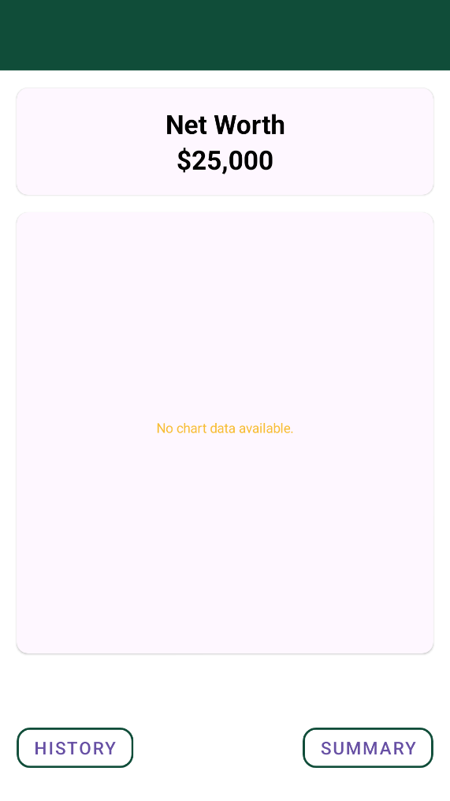
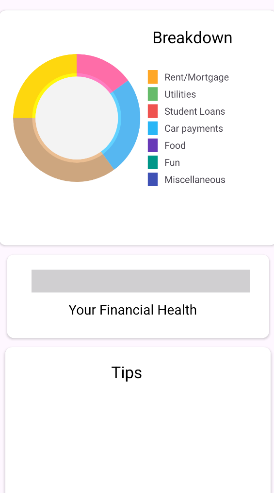

# MyMoneyTracker App
A Kotlin-based mobile app to track a user’s income and expenses. 

---

## Screens & Demo  
  
  
  

## Download the app
You can visit the following link: https://github.com/SumukhP-dev/MyMoneyTracker_App/blob/master/app/release/app-release.apk to access the page and download the app.

---

## Features (What You’ll See)  
- Bar chart and TextView showing the net worth of the user
- History of transactions stored in a RecyclerView
- Add a transaction with the amount, type, date, and description in detail
- Pie chart to show the types of transactions and tips based on net worth

---

## Tech Stack  
- **Language**: Kotlin, Python, XML
- **IDE**: Android Studio
- **Packages**: Flask-RESTful, Werkzeug
- **Frontend**: Native Android UI
- **Backend**: Flask
- **Database**: Microsoft Azure SQL Database
- **Dataset Collection/Cleaning**: Microsoft Azure SQL Database
- **Model**: LLM based on tuning the llama-3.1-8b model

---

## License & Contact  
**License:** MIT  

**Author:** Sumukh Paspuleti
- [LinkedIn](https://www.linkedin.com/in/sumukh-paspuleti/)  
- [Email](mailto:spaspuleti3@gatech.edu)  
